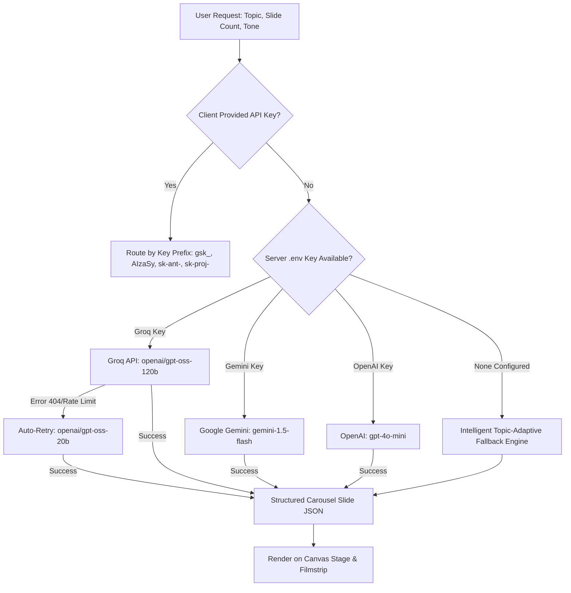

# Carouselfy — AI Instagram Carousel Automation & Design Studio

A production-ready Instagram Carousel Automation and Canva-style Design Studio built to run natively on **Hostinger Shared Hosting (Apache + PHP 8.3 + MySQL + HTML/CSS/JavaScript)** without requiring Node.js at runtime.

---

## 🌟 Key Features

- **Canva-Style Visual Editor:**
  - Multi-slide interactive canvas supporting **4:5 Portrait (1080×1350)**, **1:1 Square (1080×1080)**, and **9:16 Stories (1080×1920)**.
  - Drag-and-drop bounding boxes, corner resize handles, rotation, element reordering, opacity, and inline double-click text editing.
- **Multi-Provider AI Content Generation:**
  - Powered by **Groq (`openai/gpt-oss-120b`)** for sub-second generation, with support for **OpenAI (`gpt-4o-mini`)**, **Google Gemini (`gemini-1.5-flash`)**, **Anthropic Claude**, and **OpenRouter**.
  - Intelligent topic-adaptive content engine covering **Wellness/Health**, **Marketing/Growth**, **Finance/Wealth**, **Productivity**, and **Tech/Coding** with zero hardcoded placeholders.
  - **"Bring Your Own API Key"** UI modal with browser `localStorage` persistence.
- **Pre-Flight Design Linter:**
  - Automated quality auditor verifying Instagram safe margins (top account header, bottom action bar, swipe indicator bounds), WCAG 4.5:1 color contrast, and text overflow with a 1-click **Auto-Fix** tool.
- **Brand Kits System:**
  - Manage multiple brand presets with handles (`@yourbrand`), profile links, logo libraries, custom hex palettes, and typography presets.
- **Direct Instagram Publishing via Meta Graph API:**
  - Official Meta Graph API v20 integration supporting 2-step carousel container uploads (`carousel_item`), single image publishing, captions, and hashtag injection.
- **Automated Post Scheduler & Cron Runner:**
  - Schedule carousels for automatic publishing at peak audience engagement times, executed by Hostinger background Cron jobs.
- **Retina 2× Multi-Format Exporter:**
  - Export carousels as retina 2× ZIP (high-res PNGs), multi-page PDF documents, or single PNG/JPG slide images.

---

## 🛠 Technology Stack

| Layer | Technologies |
| :--- | :--- |
| **Backend** | Pure **PHP 8.3 / 8.2 / 8.1** (Zero Node.js dependency at runtime on shared hosting) |
| **Database** | **MySQL 5.7+ / 8.0+ / MariaDB 10.3+** via PHP PDO with prepared statements |
| **Web Server** | **Apache 2.4+** with `mod_rewrite`, `.htaccess`, HTTP security headers, and script execution prevention |
| **Frontend Studio** | Compiled React 19 & Tailwind CSS vector canvas bundled into static vanilla assets (`assets/js/studio.js`) |
| **AI Providers** | **Groq Cloud API** (`api.groq.com`), **OpenAI API** (`api.openai.com`), **Google Gemini API**, **Anthropic** |
| **Social API** | **Meta / Instagram Graph API** (Business & Creator Accounts) |

---

## 📁 Repository Directory Structure

```
├── public_html/                      # Hostinger public webroot (mirrored at root for portability)
│   ├── .htaccess                     # Apache clean routing, GZIP compression, security headers
│   ├── index.php                     # Main Carousel Studio editor entry point
│   ├── dashboard.php                 # Project management, post analytics & overview
│   ├── schedule.php                  # Scheduled posts queue & calendar
│   ├── accounts.php                  # Connected Instagram accounts & token health
│   ├── settings.php                  # System diagnostics & direct AI credentials configuration
│   ├── login.php                     # User authentication login
│   ├── register.php                  # User registration
│   ├── logout.php                    # Session termination
│   ├── assets/
│   │   ├── css/studio.css            # Compiled production CSS & typography styles
│   │   └── js/studio.js              # Compiled production studio application bundle
│   ├── api/
│   │   ├── ai/generate.php           # AI carousel generation endpoint (Groq/OpenAI/Gemini)
│   │   ├── projects/                 # Save, list, get, and delete project endpoints
│   │   ├── brandkits/                # Manage saved brand presets
│   │   ├── instagram/                # OAuth connect, callback, publish & schedule endpoints
│   │   ├── auth/                     # Session status, login, register, logout
│   │   ├── db_status.php             # Diagnostic endpoint reporting database connectivity & schema
│   │   ├── db_setup.php              # Safe non-destructive CREATE TABLE IF NOT EXISTS executor
│   │   └── upload.php                # Image and logo upload handler
│   ├── cron/
│   │   └── publish_scheduled.php     # Background post execution runner (protected by CRON_SECRET)
│   └── uploads/                      # User uploaded images & generated carousel slides
│       ├── .htaccess                 # Hardened against script execution (PHP disabled)
│       └── .gitkeep
├── config/
│   ├── config.php                    # Application configuration, provider auto-detection & .env parser
│   ├── config.example.php            # PHP configuration array template
│   └── database.php                  # Thread-safe PDO MySQL connection singleton
├── includes/
│   ├── header.php                    # Navigation header with dark theme UI
│   ├── footer.php                    # Studio footer
│   ├── functions.php                 # CSRF protection, input sanitization, JSON helpers
│   ├── auth.php                      # Authentication and password hashing service
│   ├── ai.php                        # Multi-provider LLM dispatcher & topic fallback engine
│   └── instagram.php                 # Meta Graph API client (OAuth, media containers, publishing)
├── src/                              # TypeScript / React source files for the Studio Canvas
│   ├── components/studio/            # CanvasStage, LeftPanel, RightPanel, ElementToolbar, Filmstrip
│   ├── lib/                          # Archetypes, layout engine, exporter, generator, templates
│   └── store/studio.ts               # Zustand studio state manager with localStorage persistence
├── database.sql                      # Complete MySQL database schema (7 production tables)
├── .env.example                      # Production environment template
├── .gitignore                        # Git exclusions (.env, node_modules, sensitive credentials)
├── package.json                      # Build toolchain & dependencies for client asset compilation
├── vite.config.client.ts             # Vite configuration compiling React studio into static assets
└── README.md                         # Documentation
```

---

## ⚡ Hostinger Shared Hosting Deployment Guide

### 1. Connect GitHub Repository via Hostinger Git
1. Log in to **Hostinger hPanel** → navigate to **Websites** → click **Manage** for your domain.
2. In the sidebar under **Advanced**, select **Git**.
3. Link your repository:
   - **Repository:** `https://github.com/Stselvan251102/Instagram_Automation.git`
   - **Branch:** `main`
   - **Install directory:** Leave empty (`""`) to deploy into the default document root.
4. Enable **Auto-Deployment** so every `git push origin main` deploys automatically to Hostinger.

### 2. Configure Environment (`.env`)
In Hostinger **File Manager**, create a file named `.env` in the document root (`public_html/` or domain root):

```env
# Application Environment
APP_ENV=production
APP_URL=https://your-domain.hostingersite.com
APP_SECRET=a_random_32_character_secret_string

# Hostinger MySQL Database
DB_CONNECTION=mysql
DB_HOST=localhost
DB_PORT=3306
DB_DATABASE=u561630513_Insta_auto
DB_USERNAME=u561630513_insta_auto
DB_PASSWORD=YOUR_ACTUAL_DATABASE_PASSWORD

# Groq AI Configuration (Recommended — ultra-fast & free tier available)
GROQ_API_KEY=gsk_your_groq_api_key_here
GROQ_MODEL=openai/gpt-oss-120b

# OpenAI Configuration (Optional fallback)
OPENAI_API_KEY=sk-proj-your_openai_key_here
OPENAI_MODEL=gpt-4o-mini

# Google Gemini Configuration (Optional fallback)
GEMINI_API_KEY=AIzaSy_your_gemini_key_here
GEMINI_MODEL=gemini-1.5-flash

# Meta / Instagram Graph API Configuration
INSTAGRAM_APP_ID=YOUR_FACEBOOK_APP_ID
INSTAGRAM_APP_SECRET=YOUR_FACEBOOK_APP_SECRET
INSTAGRAM_REDIRECT_URI=https://your-domain.hostingersite.com/api/instagram/callback.php
INSTAGRAM_GRAPH_VERSION=v20.0

# Cron Security Secret Token
CRON_SECRET=YOUR_SECURE_CRON_TOKEN
```

### 3. Initialize Database Tables Safely
The application includes a safe, non-destructive database initializer that uses `CREATE TABLE IF NOT EXISTS`:

Visit the following URL in your browser or run via `curl`:
```bash
curl "https://your-domain.hostingersite.com/api/db_setup.php?token=YOUR_SECURE_CRON_TOKEN"
```

Verify that all 7 tables are present:
```bash
curl "https://your-domain.hostingersite.com/api/db_status.php?token=YOUR_SECURE_CRON_TOKEN"
```
Response will return: `"ready_for_production": true`.

### 4. Setup Hostinger Cron Job for Auto-Publishing
To automatically publish scheduled carousels at their target time:
1. In hPanel, go to **Advanced → Cron Jobs**.
2. Select **Custom** interval: Every 5 minutes (`*/5 * * * *`).
3. Add the command:
   ```bash
   curl -s "https://your-domain.hostingersite.com/cron/publish_scheduled.php?token=YOUR_SECURE_CRON_TOKEN" >/dev/null 2>&1
   ```

---

## 🤖 AI Provider Architecture

Carouselfy features a resilient multi-provider dispatch system:



### Groq Key Auto-Detection
Any API key starting with `gsk_` is automatically routed to Groq (`https://api.groq.com/openai/v1/chat/completions`) using model `openai/gpt-oss-120b`. If access to that model is unavailable, it automatically retries with `openai/gpt-oss-20b`.

### Managing AI Keys in Settings
Users can configure and test their AI credentials without editing files by opening `/settings.php` and entering their API keys in the **AI Generative Engine Setup** panel.

---

## 📸 Meta / Instagram Graph API Configuration

To publish carousels directly to Instagram:

1. **Meta Developer Portal:**
   - Create an app at [developers.facebook.com](https://developers.facebook.com/) with type **Business**.
   - Add the **Instagram Graph API** and **Facebook Login for Business** products.
2. **Permissions Required:**
   - `instagram_basic`
   - `instagram_content_publish`
   - `pages_show_list`
   - `pages_read_engagement`
3. **Redirect URI:**
   - In Facebook Login settings, add:
     `https://your-domain.hostingersite.com/api/instagram/callback.php`
4. **Publishing Pipeline:**
   - Uploads each slide image to `uploads/` with a public HTTPS URL.
   - Creates child media containers using `POST /{ig-user-id}/media?image_url=...&is_carousel_item=true`.
   - Creates the parent container using `POST /{ig-user-id}/media?media_type=CAROUSEL&children=...&caption=...`.
   - Publishes the post using `POST /{ig-user-id}/media_publish?creation_id={parent-container-id}`.

---

## 💻 Local Development & Build Workflow

### 1. Requirements
- PHP 8.1+ with `curl`, `pdo_mysql`, `openssl`, `mbstring`, and `gd`.
- Node.js 18+ (only needed if editing TypeScript/React studio components in `src/`).

### 2. Local PHP Server
Run locally without Apache:
```bash
php -S 127.0.0.1:8000 -t public_html
```

### 3. Rebuilding the Studio Frontend
If you modify any files in `src/components/`, `src/lib/`, or `src/store/`:
```bash
# Install dependencies
npm install

# Build the client bundle directly into public_html/assets/
npm run build:client

# Mirror assets to root
powershell -Command "Copy-Item -Path 'public_html/assets/*' -Destination 'assets' -Recurse -Force"
```

---

## 📡 REST API Reference

| Method | Endpoint | Description |
| :--- | :--- | :--- |
| `POST` | `/api/ai/generate.php` | Generate structured carousel slides (`topic`, `count`, `tone`, optional `apiKey`) |
| `POST` | `/api/projects/save.php` | Save or update a carousel project JSON |
| `GET` | `/api/projects/list.php` | List saved projects with thumbnails and dates |
| `GET` | `/api/projects/get.php?id={id}` | Retrieve a project by ID |
| `POST` | `/api/projects/delete.php` | Delete a saved project |
| `GET` | `/api/brandkits/list.php` | Retrieve saved brand kit presets |
| `POST` | `/api/upload.php` | Upload an image, slide export, or brand logo |
| `POST` | `/api/instagram/publish.php` | Publish a carousel immediately to Instagram |
| `POST` | `/api/instagram/schedule.php` | Add a carousel to the publishing queue |
| `GET` | `/api/db_status.php?token={token}` | Check database connection and schema health |
| `GET` | `/api/db_setup.php?token={token}` | Safe non-destructive database table initializer |
| `GET` | `/cron/publish_scheduled.php?token={token}` | Scheduled post automation runner |

---

## 🔒 Security Best Practices

- **Upload Folder Protection:** `public_html/uploads/.htaccess` disables PHP script execution, preventing malicious file uploads.
- **CSRF Tokens:** All user actions (login, register, brand kits, projects) enforce CSRF verification.
- **SQL Injection Prevention:** 100% of database queries use PDO prepared statements with parameterized bounds.
- **Token Masking:** Sensitive API keys are never echoed back to client-side scripts in plain text.
- **Cron Protection:** Background publishing scripts require the secret `CRON_SECRET` query token.

---

## 📄 License

This project is licensed under the MIT License.
